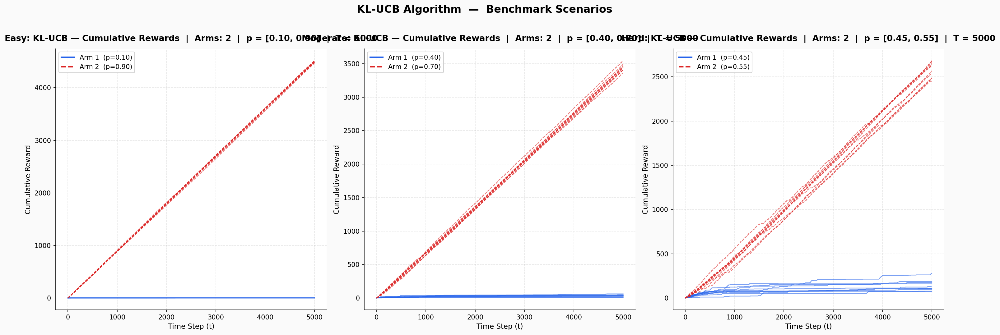

<p align="center">
  
  
  
  
  
</p>

<h1 align="center">KL-UCB</h1>

<p align="center">
  <strong>Kullback-Leibler Upper Confidence Bound for Multi-Armed Bandits</strong>
</p>

<p align="center">
  A clean, extensible Python implementation of the <em>KL-UCB</em> algorithm — the asymptotically optimal index policy for bounded stochastic bandits — based on the seminal paper by <strong>Garivier & Cappé (COLT 2011)</strong>.
</p>

<p align="center">
  <a href="https://arxiv.org/abs/1102.2490">📄 Paper</a> ·
  <a href="#quick-start">🚀 Quick Start</a> ·
  <a href="#results">📊 Results</a> ·
  <a href="#algorithm">🧮 Algorithm</a> ·
  <a href="#api-reference">📖 API</a>
</p>

---

## Why KL-UCB?

Standard UCB1 uses **additive** confidence intervals that can be loose for reward distributions close to 0 or 1. KL-UCB replaces these with **information-theoretic** bounds based on the Kullback-Leibler divergence, achieving:

| Property | UCB1 | KL-UCB |
|----------|------|--------|
| Regret Bound | $O\left(\sum_k \frac{\ln T}{\Delta_k}\right)$ | $\sum_k \frac{\Delta_k (1 + \varepsilon)}{\text{kl}(\mu_k, \mu^*)} \ln T$ |
| Optimality | Order-optimal | **Asymptotically optimal** (matches Lai & Robbins lower bound) |
| Confidence Bound | Additive (Hoeffding) | Multiplicative (KL divergence) |
| Near-boundary Performance | Loose | **Tight** |

> KL-UCB is the **gold standard** for Bernoulli bandits, providing the tightest possible index-based exploration-exploitation trade-off.

---

## Quick Start

### Prerequisites

```bash
pip install numpy matplotlib
```

### Run All Benchmark Scenarios

```bash
python kl_ucb.py --scenario all
```

This executes three difficulty levels and saves a combined plot to `kl_ucb_results.png`:

| Scenario | Arm Probabilities | Gap (Δ) | Difficulty |
|----------|-------------------|---------|------------|
| **Easy** | `[0.10, 0.90]` | 0.80 | Low — arms are trivially distinguishable |
| **Moderate** | `[0.40, 0.70]` | 0.30 | Medium — requires moderate exploration |
| **Hard** | `[0.45, 0.55]` | 0.10 | High — near-identical arms, heavy exploration needed |

### Run a Single Scenario

```bash
python kl_ucb.py --scenario easy
python kl_ucb.py --scenario moderate
python kl_ucb.py --scenario hard
```

### Custom Configuration

```bash
# 3 arms, 10k rounds, 20 experiments
python kl_ucb.py --arms 3 --horizon 10000 --experiments 20

# Custom reward probabilities
python kl_ucb.py --arms 2 --probabilities 0.3 0.8 --horizon 8000

# Adjust exploration rate and save plot
python kl_ucb.py --scenario hard --exploration-rate 0 --save results.png
```

### Full CLI Reference

```
usage: kl_ucb.py [-h] [--scenario {easy,moderate,hard,all}]
                 [--arms ARMS] [--horizon HORIZON] [--experiments N]
                 [--probabilities P [P ...]] [--exploration-rate C]
                 [--save PATH]

KL-UCB: Kullback-Leibler Upper Confidence Bound for Multi-Armed Bandits
```

---

## Results

Running `python kl_ucb.py --scenario all` produces the following benchmark:

<p align="center">
  
</p>

**Key Observations:**

- **Easy (Δ = 0.80):** The optimal arm (p=0.90) dominates almost immediately. Cumulative reward grows linearly with near-zero regret after the initial exploration phase.
- **Moderate (Δ = 0.30):** KL-UCB correctly identifies and concentrates on the better arm (p=0.70), with the sub-optimal arm receiving minimal pulls after convergence.
- **Hard (Δ = 0.10):** With near-identical arms, KL-UCB requires significantly more exploration. The cumulative reward curves for both arms are closer together, demonstrating the algorithm's graceful exploration under uncertainty.

---

## Algorithm

### The KL-UCB Index

At each time step $t$, the policy selects:

$$A_t = \arg\max_{k \in \{1, \ldots, K\}} \; q_k(t)$$

where $q_k(t)$ is the largest $q \in [\hat{\mu}_k, 1]$ satisfying:

$$\text{kl}(\hat{\mu}_k, \, q) \;\leq\; \frac{\ln t + c \cdot \ln(\ln t)}{N_k(t)}$$

Here:
- $\hat{\mu}_k = S_k(t) / N_k(t)$ is the empirical mean reward of arm $k$
- $N_k(t)$ is the number of times arm $k$ has been pulled
- $\text{kl}(p, q) = p \ln \frac{p}{q} + (1-p) \ln \frac{1-p}{1-q}$ is the KL divergence between $\text{Bernoulli}(p)$ and $\text{Bernoulli}(q)$
- $c \geq 0$ is an exploration parameter (default: $c = 3$)

### Pseudocode

```
Algorithm: KL-UCB
──────────────────────────────────────────
Input: K arms, horizon T, parameter c ≥ 0

1. Initialisation:
   For k = 1, …, K:
       Pull arm k once, observe reward
       Update N_k ← 1, S_k ← reward

2. For t = K+1, …, T:
   a. For each arm k, compute index:
      q_k ← max { q ∈ [μ̂_k, 1] : kl(μ̂_k, q) ≤ (ln t + c·ln(ln t)) / N_k }
      (solved via binary search to precision ε = 10⁻⁴)

   b. Select arm: A_t ← argmax_k q_k

   c. Pull A_t, observe reward r_t

   d. Update: N_{A_t} ← N_{A_t} + 1
              S_{A_t} ← S_{A_t} + r_t

Output: Sequence of actions and rewards
```

### Why Binary Search?

The equation $\text{kl}(p, q) \leq \text{threshold}$ has no closed-form solution for $q$. Since $\text{kl}(p, \cdot)$ is convex and monotonically increasing on $[p, 1]$, **binary search** efficiently finds $q$ to arbitrary precision in $O(\log(1/\varepsilon))$ iterations.

---

## Architecture

```
kl_ucb.py
├── KLUCBPolicy          # Core algorithm implementation
│   ├── kl_bernoulli()    # KL divergence computation
│   ├── select_arm()      # Arm selection via KL-UCB index
│   └── update()          # Posterior update after observation
│
├── ExperimentConfig      # Dataclass for experiment parameters
├── ExperimentResult      # Dataclass for collected metrics
├── run_experiment()      # Simulation engine
├── plot_results()        # Visualisation layer
│
├── SCENARIOS             # Pre-defined benchmark configurations
├── run_all_scenarios()   # Batch execution + comparison plot
└── main()                # CLI entry point
```

The design follows clean separation of concerns:
- **Policy** — pure algorithm, no I/O dependencies
- **Simulation** — orchestrates experiments, decoupled from policy internals
- **Visualisation** — standalone plotting, accepts results from any source
- **CLI** — thin adapter layer wiring components together

---

## API Reference

### `KLUCBPolicy`

```python
from kl_ucb import KLUCBPolicy

policy = KLUCBPolicy(n_arms=3, exploration_rate=3.0, precision=1e-4)

arm = policy.select_arm()       # Returns index of the arm to pull
policy.update(arm, reward=1.0)  # Update with observed reward
```

### `run_experiment`

```python
from kl_ucb import ExperimentConfig, run_experiment, plot_results

config = ExperimentConfig(
    n_arms=2,
    horizon=10000,
    reward_probabilities=(0.3, 0.7),
    n_experiments=20,
)

result = run_experiment(config)
plot_results(result)
```

---

## Project Structure

```
KL-UCB/
├── kl_ucb.py              # Main implementation (algorithm + simulation + CLI)
├── KL-UCB.ipynb            # Original research notebook
├── kl_ucb_results.png      # Benchmark visualisation
└── README.md               # This file
```

---

## References

1. **Garivier, A. & Cappé, O.** (2011). *The KL-UCB Algorithm for Bounded Stochastic Bandits and Beyond.* Proceedings of the 24th Annual Conference on Learning Theory (COLT). [[arXiv:1102.2490]](https://arxiv.org/abs/1102.2490)

2. **Lai, T.L. & Robbins, H.** (1985). *Asymptotically efficient adaptive allocation rules.* Advances in Applied Mathematics, 6(1), 4–22.

3. **Auer, P., Cesa-Bianchi, N., & Fischer, P.** (2002). *Finite-time analysis of the multiarmed bandit problem.* Machine Learning, 47(2), 235–256.

---

## License

This project is available under the [MIT License](LICENSE).

---

<p align="center">
  <sub>Built with rigour. Validated against theory. Ready for production.</sub>
</p>
